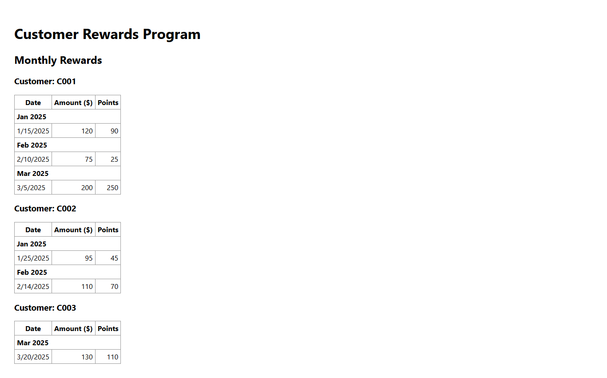
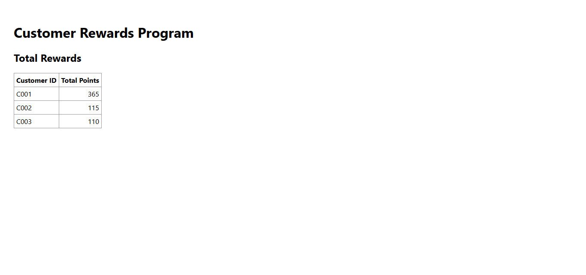
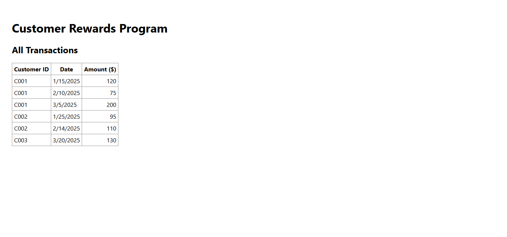

# React Rewards Dashboard

A clean and modular React.js application that calculates customer reward points from transactions and displays them in three distinct tables: User Monthly Rewards, Total Rewards, and Transactions.

## 🚀 Project Overview

This application simulates a reward points program for customers based on their purchase history. The system displays:
- **User Monthly Rewards** by month/year.
- **Total Rewards** per customer.
- **Transaction History** with product details.

The rewards logic is based on:
- $1 spent over $50 earns 1 point.
- $1 spent over $100 earns 2 points (in addition to the 1 point per $1 over $50).

## ✨ Features

- Calculates reward points:
  - 2 points per $ over $100
  - 1 point per $ between $50–$100
- 3 Tables:
  - 📆 Monthly Rewards
  - 🧮 Total Rewards Summary
  - 📜 All Transactions
- Modular, clean architecture with loading/error states
- Unit tests for core logic
- Prop validation and utility documentation

---

## 📁 Directory Structure

public/
  └── data/
      └── transactions.json
src/
  ├── components/
  |── services/
  |── styles/
  |── tests/
  ├── utils/
  ├── App.js
  └── App.test.js


---

## ⚙️ Setup & Installation

1. **Clone the repository**
   ```bash
   git clone https://github.com/manoj-cmd/Reward-Point
   cd Reward-Point

   ## 📸 Screenshots

### 🧾 Monthly Rewards, Total Rewards, Transactions Tables





### ✅ Test Run Output


## 🔧 How to Run
   
Install dependencies

npm install
Run the development server

Run Tests
npm test

npm start
Visit http://localhost:3000 in your browser.

🧠 Approach and Design Decisions
Pure Functions: All reward logic is handled via pure, testable functions in utils/rewardUtils.js.

Modular Components: Each table is its own component for maintainability.

No Redux/TypeScript: As per requirements, plain React state was used.

Date Sorting & Grouping: Transactions are sorted during render, not stored pre-sorted.

🧪 Testing
Jest and React Testing Library are used to test:

Reward calculation functions

Component rendering

Edge cases and UI behavior

To run tests:

npm test
🧮 Reward Logic
js
if (amount > 100) {
  points = 2 * (amount - 100) + 50;
} else if (amount > 50) {
  points = amount - 50;
}

Handles:

Fractional prices: $100.4 earns 50 points.
Multiple years/months.
Aggregation across months/years.

🖼️ Screenshots
✅ User Monthly Rewards Table

🧾 Transaction History

🧮 Total Rewards Table

⏳ Loading State

⚠️ Error State

Screenshots are stored in the public/screenshots/ folder.

🤝 Contributing
Fork the repo

Create a new branch (git checkout -b feature/fooBar)

Commit your changes (git commit -am 'Add some fooBar')

Push to the branch (git push origin feature/fooBar)

Open a Pull Request